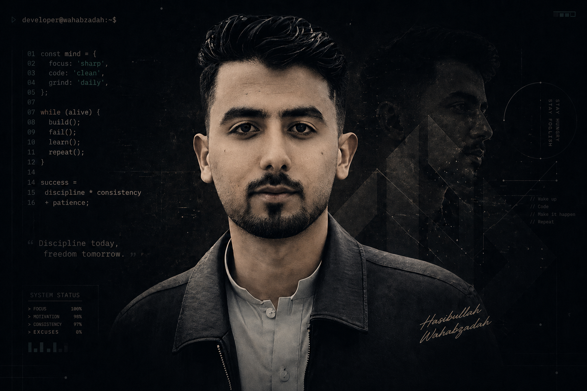

<div align = "center">
  
  <br/>
  <br/>
  <h1>Hi 👋 I'm Hasibullah Wahabzadah</h1>
  <p> I am professional at designing, developing and implementing beautiful & effective websites and applications.</p>
<!--    -->
</div>
<div>
  <h2>💻 Languages</h2>
  
 
</div>

<div>
  <h2>🚀 Frameworks & Libraries</h2>
  
  
</div>

<div>
  <h2>🔧 Tools</h2>
  

</div>

<div>
  <h2>🖌️ Design Tools</h2>
  
  
  
</div>

<div>
  <h2>📱 My Social Networks</h2>
  <a href="https://www.linkedin.com/in/hasibullah-wahabzadah-45884b26b/" rel="nofollow">
    
  </a>
  <a href="https://api.whatsapp.com/send?phone=93794454095" rel="nofollow">
    
  </a>
  <a href="https://t.me/HWE0040" rel="nofollow">
    
  </a>
  <a href="https://www.instagram.com/hasibullah_wahabzadah/" rel="nofollow">
    
  </a>
</div>

<h1>📖 About Me</h1>

```javascript
class HasibullahWahabzadah {
    constructor() {
        this.full_name = "Hasibullah Wahabzadah";
        this.age = 22;
        this.education = "BS student in Computer Science";
        this.languages = ["HTML", "CSS", "JavaScript", "Sass", "jQuery"];
        this.frameworks = ["Bootstrap", "Tailwind CSS", "React"];
        this.favorites = [
            "coding",
            "learning new skills",
            "graphic design"
            "reading",
            "horse riding",
            "volleyball",
        ];
        this.learning = [
            "Advanced React techniques",
            "Webflow",
            "Backend",
            "UI/UX Design principles"
        ];
        this.working_on = ["building a stunning personal portfolio", "learning new frameworks"];
        this.superpower = "Transforming complex ideas into elegant and functional web interfaces.";
    }
}

